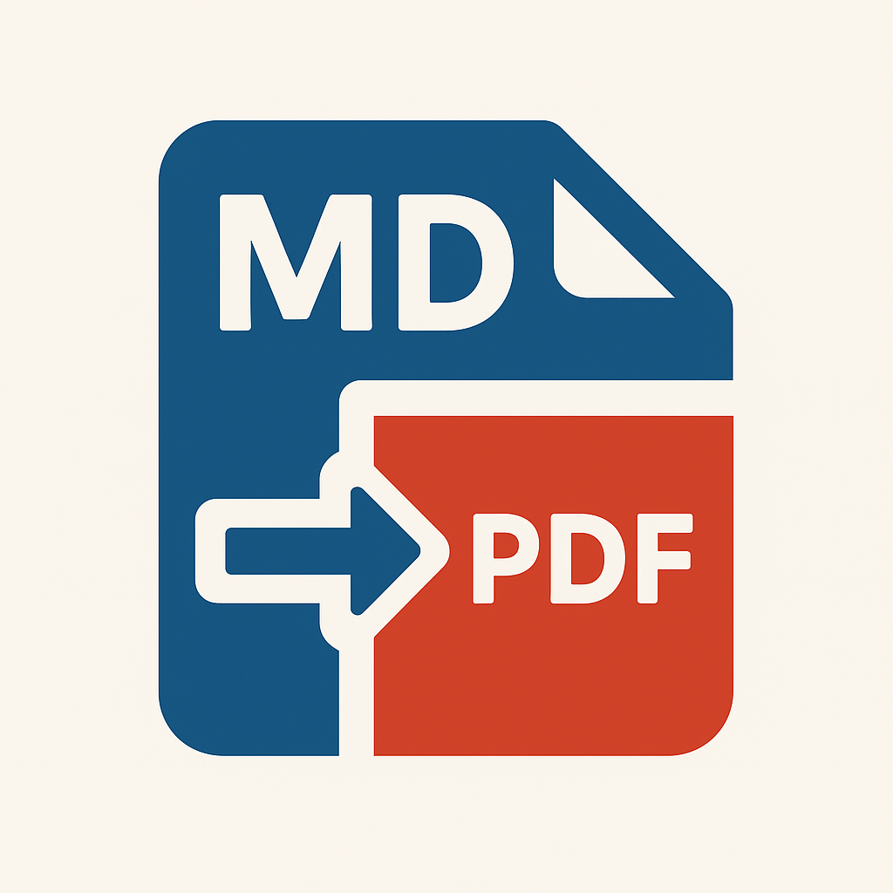
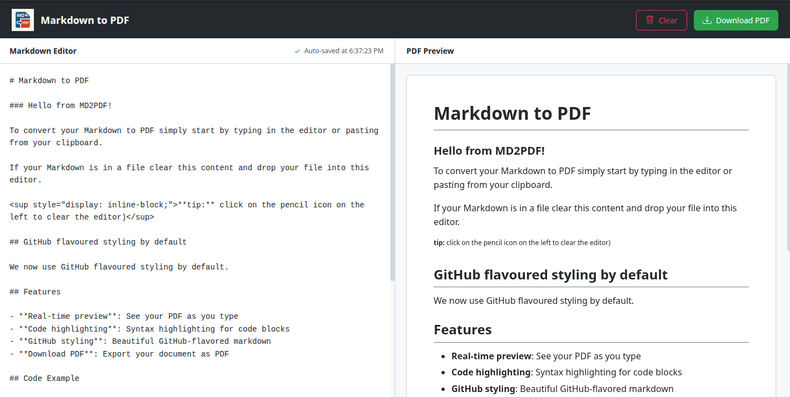

<div align="center">
  
  
  # Markdown to PDF Converter
  
  **A beautiful, modern web app to convert Markdown to high-quality PDF documents**
  
  [](https://react.dev/)
  [](https://www.typescriptlang.org/)
  [](https://vitejs.dev/)
  
  [Live Demo](https://your-demo-url.netlify.app) · [Report Bug](https://github.com/mirkobertone/md2pdf/issues) · [Request Feature](https://github.com/mirkobertone/md2pdf/issues)
  
</div>

---

## ✨ Features

- 🎨 **Real-time Preview** - See your formatted document as you type
- 📝 **GitHub-Flavored Markdown** - Full GFM support with beautiful styling
- 🎯 **Syntax Highlighting** - Code blocks with automatic language detection
- 📄 **High-Quality PDF Export** - Crystal-clear text and sharp rendering (300 DPI)
- 💾 **Auto-Save** - Your work is automatically saved to browser storage
- 🎭 **Clean UI** - Modern, intuitive interface inspired by GitHub
- 📱 **Responsive Design** - Works seamlessly on desktop and mobile
- 🚀 **Fast & Lightweight** - Built with Vite for optimal performance
- 🔒 **Privacy First** - All processing happens in your browser, no server uploads

## 🎬 Demo

<div align="center">
  
</div>

## 🚀 Quick Start

### Prerequisites

- Node.js (v18 or higher)
- pnpm (recommended) or npm

### Installation

1. **Clone the repository**

   ```bash
   git clone https://github.com/mirkobertone/md2pdf.git
   cd md2pdf
   ```

2. **Install dependencies**

   ```bash
   pnpm install
   # or
   npm install
   ```

3. **Start the development server**

   ```bash
   pnpm dev
   # or
   npm run dev
   ```

4. **Open your browser**

   Navigate to `http://localhost:5173` and start converting! 🎉

## 📦 Build for Production

```bash
pnpm build
# or
npm run build
```

The optimized production build will be generated in the `dist/` directory.

### Preview Production Build

```bash
pnpm preview
# or
npm run preview
```

## 🛠️ Technology Stack

- **Frontend Framework:** React 19 with TypeScript
- **Build Tool:** Vite
- **Markdown Parser:** [Marked](https://marked.js.org/)
- **Syntax Highlighting:** [Highlight.js](https://highlightjs.org/)
- **PDF Generation:** [html2pdf.js](https://github.com/eKoopmans/html2pdf.js)
- **Styling:** GitHub Markdown CSS + Custom CSS
- **Code Quality:** ESLint + TypeScript

## 📖 Usage

### Basic Workflow

1. **Write/Paste Markdown** - Type or paste your markdown content in the left editor panel
2. **Preview** - See the formatted output in real-time on the right panel
3. **Export** - Click "Download PDF" to generate your high-quality PDF document

### Markdown Support

MD2PDF supports all GitHub-Flavored Markdown features:

- ✅ Headings (H1-H6)
- ✅ Bold, italic, and strikethrough text
- ✅ Lists (ordered and unordered)
- ✅ Code blocks with syntax highlighting
- ✅ Inline code
- ✅ Tables
- ✅ Blockquotes
- ✅ Horizontal rules
- ✅ Links and images
- ✅ Task lists
- ✅ HTML elements

### Example Markdown

````markdown
# Welcome to MD2PDF

## Features

- **Real-time preview**
- Syntax highlighting
- Beautiful GitHub styling

## Code Example

```javascript
function convertToPDF() {
  console.log("Converting markdown to PDF!");
  return "success";
}
```

## Table

| Feature          | Status |
| ---------------- | ------ |
| Markdown parsing | ✅     |
| PDF export       | ✅     |
````

## 🎨 Customization

### Modifying Styles

The main stylesheet is located at `src/App.css`. You can customize:

- Colors and theme
- Font sizes and families
- Layout and spacing
- PDF preview styling

### PDF Export Settings

PDF generation settings can be adjusted in `src/App.tsx` in the `handleDownloadPDF` function:

```typescript
const opt = {
  margin: [15, 15, 15, 15], // Page margins
  image: { type: "jpeg", quality: 0.98 }, // Image quality
  html2canvas: {
    scale: 2, // Higher = better quality, larger file
    dpi: 300, // Print quality DPI
  },
  // ... more options
};
```

## 🤝 Contributing

Contributions are welcome! Here's how you can help:

1. Fork the repository
2. Create a feature branch (`git checkout -b feature/amazing-feature`)
3. Commit your changes (`git commit -m 'Add some amazing feature'`)
4. Push to the branch (`git push origin feature/amazing-feature`)
5. Open a Pull Request

### Development Guidelines

- Follow the existing code style
- Write clear, descriptive commit messages
- Test your changes thoroughly
- Update documentation as needed

## 📝 License

This project is licensed under the MIT License - see the [LICENSE](LICENSE) file for details.

## 🙏 Acknowledgments

- [Marked.js](https://marked.js.org/) - Markdown parser
- [Highlight.js](https://highlightjs.org/) - Syntax highlighting
- [html2pdf.js](https://github.com/eKoopmans/html2pdf.js) - PDF generation
- [GitHub Primer CSS](https://primer.style/) - Design inspiration
- [React](https://react.dev/) - UI framework

## 📧 Contact

Have questions or feedback? Feel free to:

- Open an issue on GitHub
- Reach out via email: your.email@example.com
- Connect on [Twitter](https://twitter.com/mirkobertone)

---

<div align="center">
  Made with ❤️ by <a href="https://github.com/mirkobertone">Your Name</a>
  
  If you found this project helpful, please consider giving it a ⭐️!
</div>
