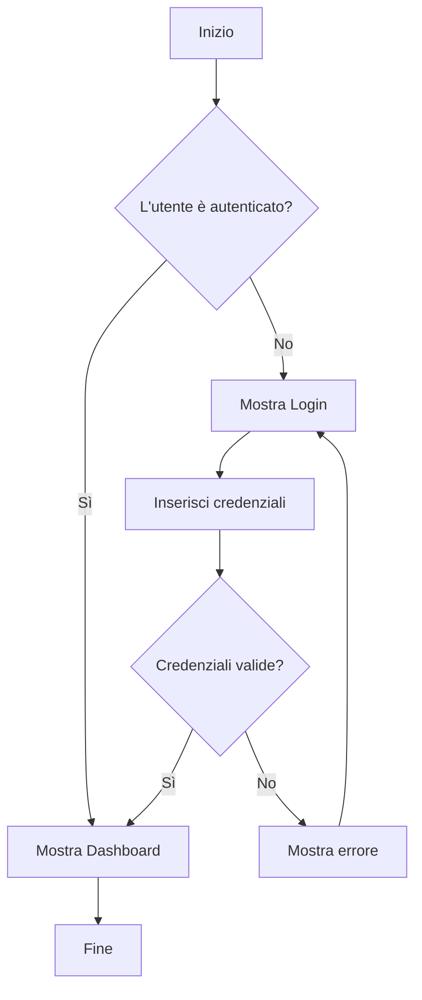
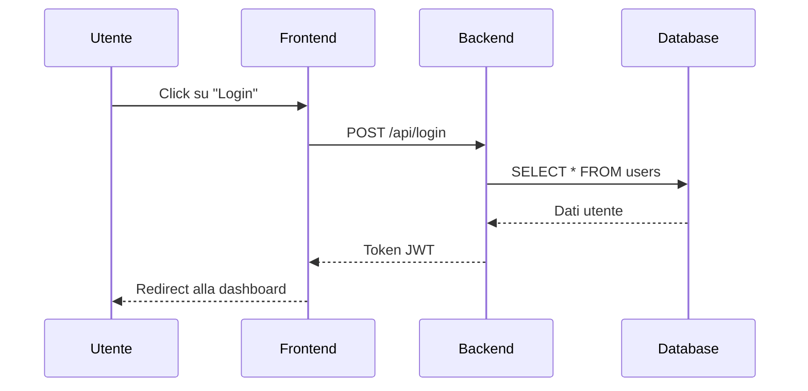
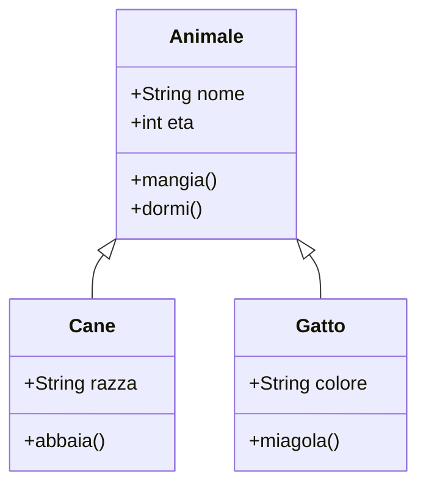
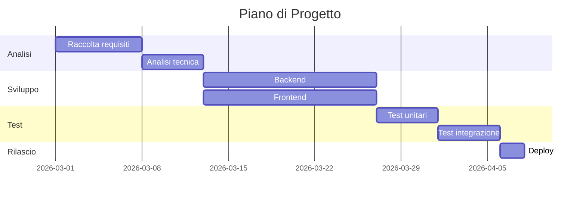
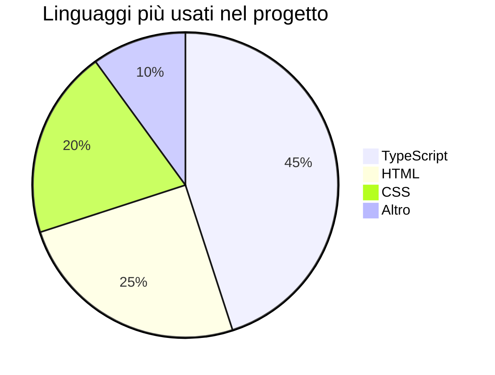
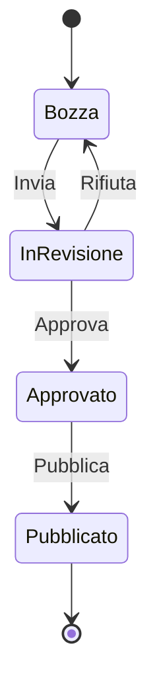

# Esempio di diagrammi Mermaid

## Diagramma di flusso

```mermaid
flowchart TD
    A[Inizio] --> B{L'utente è autenticato?}
    B -- Sì --> C[Mostra Dashboard]
    B -- No --> D[Mostra Login]
    D --> E[Inserisci credenziali]
    E --> F{Credenziali valide?}
    F -- Sì --> C
    F -- No --> G[Mostra errore]
    G --> D
    C --> H[Fine]
```

## Diagramma di sequenza

```mermaid
sequenceDiagram
    participant U as Utente
    participant F as Frontend
    participant B as Backend
    participant DB as Database

    U->>F: Click su "Login"
    F->>B: POST /api/login
    B->>DB: SELECT * FROM users
    DB-->>B: Dati utente
    B-->>F: Token JWT
    F-->>U: Redirect alla dashboard
```

## Diagramma delle classi

```mermaid
classDiagram
    class Animale {
        +String nome
        +int eta
        +mangia()
        +dormi()
    }
    class Cane {
        +String razza
        +abbaia()
    }
    class Gatto {
        +String colore
        +miagola()
    }
    Animale <|-- Cane
    Animale <|-- Gatto
```

## Diagramma di Gantt

```mermaid
gantt
    title Piano di Progetto
    dateFormat  YYYY-MM-DD
    section Analisi
        Raccolta requisiti     :a1, 2026-03-01, 7d
        Analisi tecnica        :a2, after a1, 5d
    section Sviluppo
        Backend                :s1, after a2, 14d
        Frontend               :s2, after a2, 14d
    section Test
        Test unitari           :t1, after s1, 5d
        Test integrazione      :t2, after t1, 5d
    section Rilascio
        Deploy                 :r1, after t2, 2d
```

## Diagramma a torta

```mermaid
pie title Linguaggi più usati nel progetto
    "TypeScript" : 45
    "HTML" : 25
    "CSS" : 20
    "Altro" : 10
```

## State Diagram

```mermaid
stateDiagram-v2
    [*] --> Bozza
    Bozza --> InRevisione : Invia
    InRevisione --> Approvato : Approva
    InRevisione --> Bozza : Rifiuta
    Approvato --> Pubblicato : Pubblica
    Pubblicato --> [*]
```
